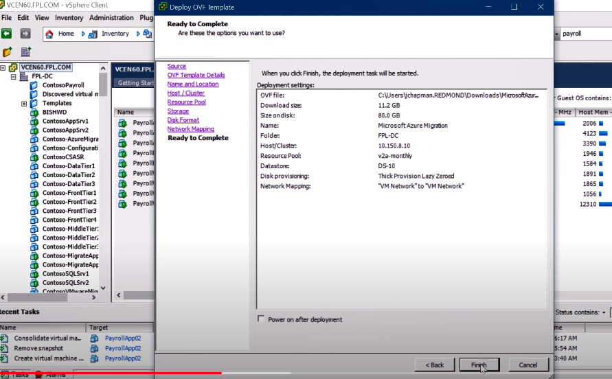
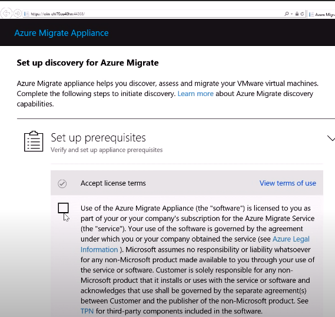
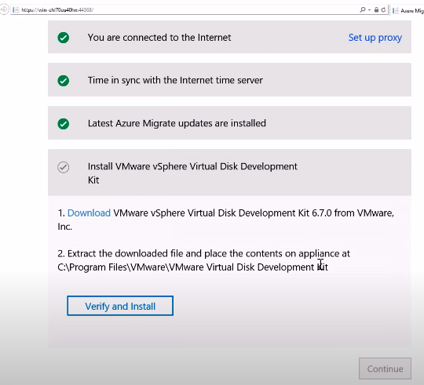
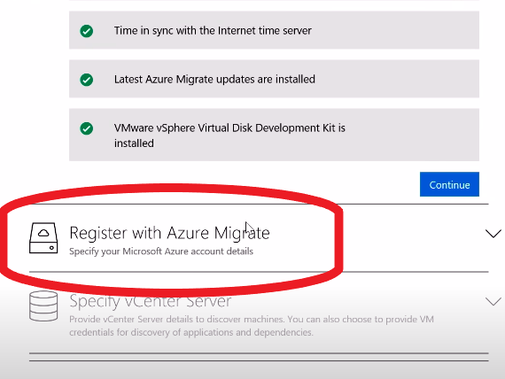
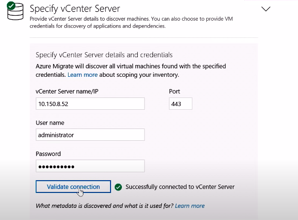
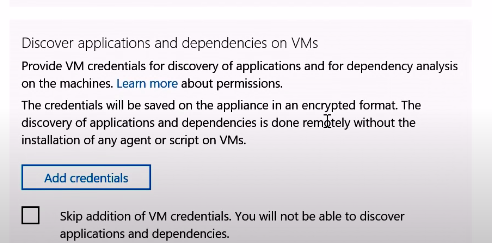
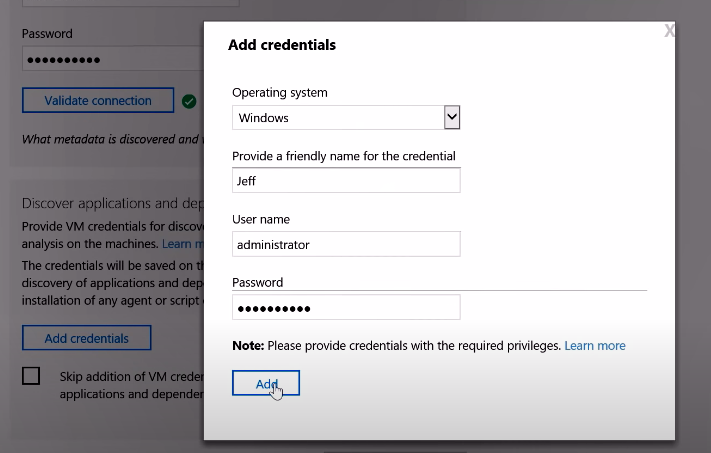

# Assessment de VMs corriendo en VMware 
Esta evaluación mide el consumo de recursos de las VMs en VMware. El reporte del consumo es enviado a Azure para brindar recomendación del tamaño de la VM en Azure.

# Requerimientos

El assessment de las VMs en VMware se realiza por medio de un appliance corriendo dentro del mismo VMware. 

El appliance requiere que se le aprovisione en VMware lo siguiente:
- 32GB RAM
- 8 vCPUs
- 80GB de disco

Estos requerimientos dependerán de la cantidad de VMs a evaluar, es posible que sea menor pero intentar mantenerse lo más cerca de estos requerimientos.

El appliance a instalar corre en Windows Server 2016.


## vCenter Server
Las máquinas virtuales que se desean descubrir y analizar deben estar administradas por vCenter Server versión 5.5, 6.0, 6.5, 6.7 o 7.0.

Descubrir VMs directamente desde ESXi no está soportado.


## Permisos
### Permisos de vCenter
Se necesita crear cuenta con permisos de lectura en el vCenter Server para el descubrimiento y evaluación de las VMs. Para descubrimiento de dependencias de aplicaciones, asegurarse que esa misma cuenta necesita habilitación de privilegios para **Virtual Machines > Guest Operations** 

Esto se realiza desde la configuración de **Access Control**:


[Ver configuración paso a paso](https://gist.github.com/daniel-fv/3cc6976c93a51920589f72be06f59277) de la creación de usuario en VMware.

### Permisos de administrador en las VMs
Para hacer descubrimieto de aplicaciones que corren en las VMs se necesita el usuario administrador de las VMs que se evaluarán, ya sea para servidores en Windows o Linux.

# Instalación del appliance
1- Descargamos la [imagen OVA para VMware](https://go.microsoft.com/fwlink/?linkid=2140333) del appliance.


2- Importamos la imagen
 

  

3- Configuramos los recursos para el appliance con:
- 32GB RAM
- 8 vCPUs
- 80GB de disco
- Red: se necesita salida a internet para conectarse a Azure pero no se requiere IP público en el appliance.



&emsp;


4- Una vez instalada y corriendo nos conectamos por un navegador web al IP del appliance en el puerto 44368
```
https://<ip-de-appliance>:44368
```

También nos podemos conectar por escritorio remoto (RDP) en el puerto 3389 del appliance.

Con esto, iniciamos la configuración aceptando los términos de licencia.

  

5- El appliance se conectará a Azure para descargar actualizaciones si lo requiere y pedirá instalar el **vSphere Virtual Disk Development Kit** (si no se ha instalado anteriormente).

  

6- Una vez instalado el Kit, registramos el appliance con Azure. 

*Este paso lo realiza personal de Nova Cloud / Condor Comunicaciones*.

  

7- Nos conectamos al servidor **IP del servidor vCenter** con **usuario con permisos de lectura** que creamos al inicio.

  


8- Descubrimiento de aplicaciones y dependencias. Este paso es opcional pero recomendado. Se debe de agregar **credenciales de administrador para las VMs** que vamos a descubrir tanto para Windows (usuario Administrador) como para Linux (usuario root).


  

  

Podemos agregar todas las credenciales que necesitemos una por una para el descubrimiento de apliaciones en las VMs.

9- Con las credenciales agregadas, iniciamos el descubrimiento.

  


-----
## Más información
- https://docs.microsoft.com/en-us/azure/migrate/migrate-support-matrix-vmware
- https://docs.microsoft.com/en-us/azure/migrate/migrate-appliance#appliance---vmware
